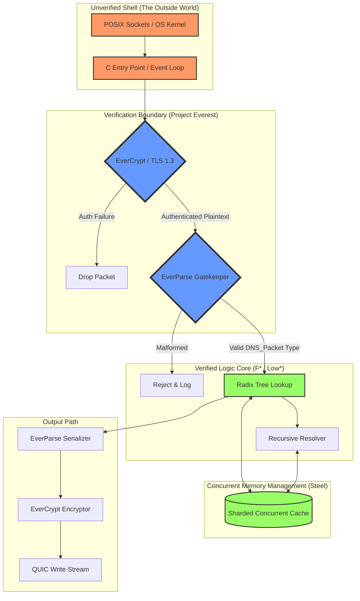

# Architectural Design: Verified DNS-over-QUIC Server

This document outlines the high-assurance architecture of the server, focusing on the separation between verified and unverified components.

## Layered Security Architecture

The server is designed as a series of defensive rings. Each layer must pass its own verification checks before data is allowed to penetrate deeper into the system.

---

## Architectural Pillars

### 1. The Parser-Rejecting Boundary
The most critical security layer is the **EverParse** validator. Unlike traditional DNS parsers that may attempt to "fix" or partially parse malformed data, our server rejects any packet that does not perfectly conform to the formal F* specification of a DNS message. This eliminates entire classes of "Shotgun Parsing" vulnerabilities.

**Parser strategy decision:** EverParse remains the target architecture for the production parser and serializer. The current handwritten F*/Low* parser is a bootstrap/reference implementation used to close DNS semantics, establish tests, and exercise the verified Low* buffer boundary early. It should not silently become a second permanent parser architecture. Once the DNS grammar and tests are stable, the EverParse-generated parser should either replace the handwritten parser or be proved behaviorally equivalent to it.

### 2. Separation of Concerns: Shell vs. Core
- **The Shell (Unverified):** Responsible for "messy" tasks like socket syscalls, thread scheduling, and signal handling. It is written in C, kept as small as possible, and constrained by the contract in [UNVERIFIED_SHELL.md](UNVERIFIED_SHELL.md).
- **The Core (Verified):** Responsible for the "intelligence" of the server. All protocol logic, state transitions, and cryptographic operations happen here. It is written in F* and extracted to C only after proofs are closed.

### 3. Language-Based Security
Because we use **Steel** (F*'s concurrency framework), we don't rely on OS-level process isolation for internal safety. Instead, we use **Separation Logic** to mathematically prove that even though threads share an address space, they cannot interfere with each other's memory or cause data races.

### 4. Post-Quantum Readiness
The architecture is modular at the cryptographic layer. The `DNS.Security` module is designed to support **Hybrid Key Exchange** (X25519 + ML-KEM), ensuring that the DNS traffic remains confidential even against future quantum adversaries.

## Data Flow (The Query Lifecycle)

1.  **Ingress:** A QUIC packet is received by the Unverified Shell.
2.  **Authentication:** `EverCrypt` decrypts the packet. If the AEAD check fails, the packet is discarded immediately.
3.  **Validation:** `EverParse` transforms the raw bytes into a high-level F* `DNS_Packet` record. This process is proven to be memory-safe and overflow-free.
4.  **Lookup:** The `Verified Logic` searches the `Radix Tree` (for authoritative data) or the `Sharded Cache` (for recursive data).
5.  **Bailiwick Check:** For recursive results, the server performs a proven suffix-match to prevent cache poisoning.
6.  **Egress:** The response is serialized, encrypted, and sent back via the QUIC transport.
